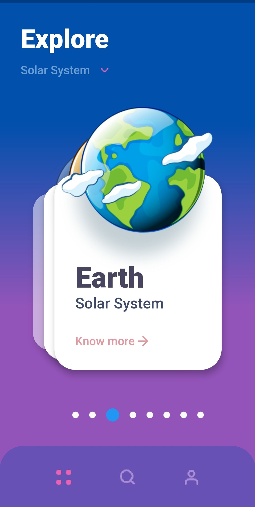
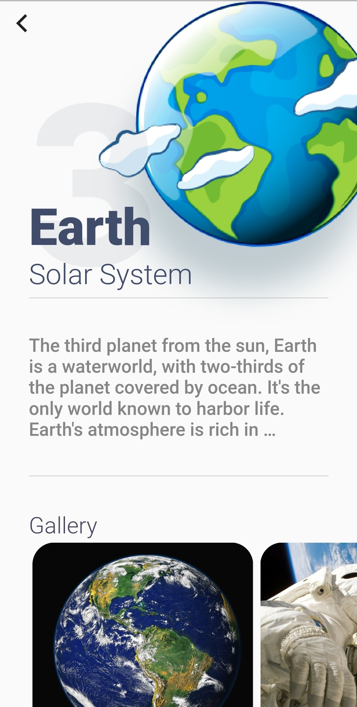

# Solar System
### A minimal design app thats contains information about different planets in Solar System. For a smooth flow, the swiper dependency is used for the planet cards.

#### Here's the home page of the application and the detail page of every planet .

